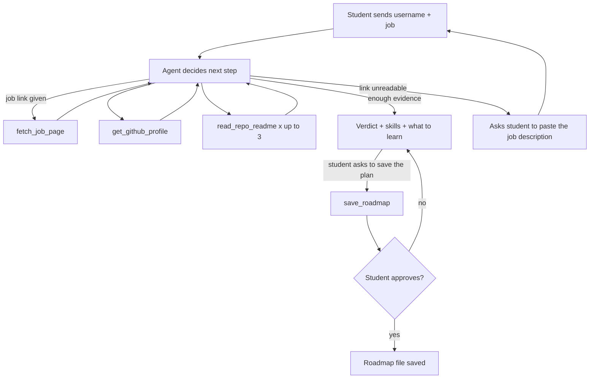

# Job-Ready Agent

**An AI agent that reads your real GitHub work and a real job description, then tells you if you are eligible for that job, and what to learn if you are not.**

Give it a GitHub username and a job description (pasted text or a link). The agent decides what to check, reads your repositories, and answers one question: *"Am I ready for this job?"*

Built as a small, focused project to show how an agent behaves: it chooses its own tools, recovers from failures, remembers the conversation, and asks for human approval before it writes anything.

---

## What you get

```
Verdict: Not yet eligible. None of the required skills are found in your GitHub.

Skills to learn:
- Kubernetes: Learn Docker first, then Kubernetes basics.
  Project: deploy a two-container app on a local cluster.
- Kafka: Learn event-driven design.
  Project: build a producer and a consumer that exchange real-time events.
```

When the work matches, the answer is a verdict, the skills found with the repos that show them, and which repos to lead with when applying.

| Verdict | Meaning |
|---|---|
| Eligible | Every skill the job requires is found in your GitHub |
| Partly eligible | Some required skills are found, some are not |
| Not yet eligible | Fewer than half of the required skills are found |

---

## How the agent works



1. The student sends a GitHub username and a job description or link.
2. The agent calls tools. It decides which ones, in what order, and how many.
3. Each tool result goes back to the model, which decides the next step.
4. When it has enough evidence, it answers with the verdict.
5. Saving a roadmap is optional. If the student asks, the agent requests `save_roadmap`, and the server **pauses until the student approves or denies**. Nothing is written without that decision.

### Tools

| Tool | What it does | Source |
|---|---|---|
| `get_github_profile` | Lists public repos (own work first, forks last, up to 15) with language, topics and last push date | GitHub REST API |
| `read_repo_readme` | Returns the README of one chosen repo, truncated to a safe length | GitHub REST API |
| `fetch_job_page` | Returns the readable text of a job posting URL | Jina Reader (`r.jina.ai`) |
| `save_roadmap` | Saves a Markdown study plan to a local folder, **only after approval** | Local file system |

Asking the student a question is not a tool. When something is missing or unreadable, the agent replies with a question, and the student answers in the same session.

### Behaviors worth studying

| Behavior | Where to look |
|---|---|
| The model chooses which repos to read, so the path differs per request | `SYSTEM_PROMPT` in `services/agent.service.js` |
| A tool error is returned to the model, which recovers (for example, "please paste the job description") | The tool files in `tools/` |
| Conversation memory per session, so follow-up answers continue the same run | `MemorySaver` with `thread_id` |
| Human approval enforced in code, not only in the prompt | `humanInTheLoopMiddleware` |
| Clear separation: route handles HTTP, service handles the agent, tools handle the outside world | `routes/`, `services/`, `tools/` |

---

## API

### `POST /api/chat`

**First request** (start a conversation). Send `username` plus exactly one of `jobDescription` or `jobLink`:

```json
{
  "username": "your-github-username",
  "jobDescription": "Looking for a Node.js developer with Express, MongoDB and basic AI integration experience."
}
```

**Follow-up** (continue a conversation). Send the `sessionId` plus exactly one of `message` or `approval`:

```json
{ "sessionId": "<id from the first response>", "message": "Here is the job description: ..." }
```

```json
{ "sessionId": "<id from the first response>", "approval": "approved" }
```

**Response**

```json
{
  "sessionId": "e2c1ef7b-...",
  "status": "reply",
  "reply": "Verdict: Eligible. ..."
}
```

`status` is either:
- `reply`: the agent's answer or a question for the student.
- `pending_approval`: the agent wants to save a roadmap. The response includes `pendingAction` with the proposed `title` and `content`. Answer with `approval: "approved"` or `"denied"`.

| Code | Meaning |
|---|---|
| 400 | Invalid or missing input |
| 404 | Unknown `sessionId` (also after a server restart) |
| 409 | A `message` was sent while an approval is pending, or an `approval` with nothing pending |

### `GET /health`

Returns `{ "status": "ok" }`.

---

## Run it locally

**Requirements:** Node.js 20 or later, [Ollama](https://ollama.com) running locally, and a model that supports tool calling.

```bash
git clone https://github.com/rajeshThappeta/job-ready-agent
cd job-ready-agent
npm install
ollama pull qwen3:14b
cp .env.example .env     # then edit the values
node server.js
```

### Environment variables

| Variable | Purpose |
|---|---|
| `PORT` | Server port (default 5001) |
| `OLLAMA_BASE_URL` | Where Ollama runs, usually `http://localhost:11434` |
| `OLLAMA_MODEL` | A tool-calling chat model, for example `qwen3:14b` |
| `OLLAMA_NUM_CTX` | Context window to request, for example `8192` |
| `LLM_TEMPERATURE` | Keep low for reliable tool use, for example `0.1` |
| `MAX_CONTENT_CHARS` | Maximum README text sent to the model (default 8000) |
| `GITHUB_TOKEN` | Optional. Raises the GitHub API limit from about 60 requests per hour. A fine-grained token with no extra permissions is enough |
| `JINA_API_KEY` | Optional. Raises the Jina Reader rate limit |
| `ROADMAP_OUTPUT_DIR` | Where saved roadmaps go (default `./roadmaps`) |

Never commit `.env`. Only `.env.example` belongs in the repo.

### Try it with curl

```bash
curl -s -X POST http://localhost:5001/api/chat \
  -H "Content-Type: application/json" \
  -d '{"username":"your-github-username","jobDescription":"Looking for a Node.js developer with Express and MongoDB."}'
```

A response can take a minute or two, because the model reads several READMEs.

---

## Project structure

```
job-ready-agent/
├── server.js                      # Express app setup
├── routes/chat.router.js          # POST /api/chat: validation and HTTP only
├── services/agent.service.js      # model, prompt, agent, sessions, approval flow
└── tools/
    ├── get-github-profile.tool.js
    ├── read-repo-readme.tool.js
    ├── fetch-job-page.tool.js
    └── save-roadmap.tool.js
```

## Stack

Node.js · Express 5 · LangChain (`createAgent`) · LangGraph (checkpointer and approval) · Ollama (local model) · Zod · GitHub REST API · Jina Reader

---

## Honest limits

- **It judges what your GitHub shows, not what you can do.** Skills used only in private or employer code are invisible. Years of experience and degrees cannot be verified from GitHub.
- **Weak profiles get weak reports.** Repos without descriptions, topics or a README give the agent only the repo name to go on, so it can miss real skills.
- **Only the first 15 repos are listed** (own work first, then forks, newest first). An older relevant project can be missed.
- **Local models vary.** Results can differ between runs. In testing, a smaller model (`qwen3:8b`) sometimes wrote tool calls as plain text instead of making them; `qwen3:14b` was more reliable. Always check an important verdict yourself.
- **Sessions live in memory.** Restarting the server clears every conversation. A persistent checkpointer (for example a MongoDB one) would fix this.
- **No step limit yet.** A misbehaving model could loop for a long time.
- **This is a learning tool, not a hiring prediction.** It does not know what a recruiter will decide.

## Roadmap

- Step limit with a partial answer when it is reached
- Trace of the tool calls in the response, so a UI can show the agent's decisions
- Persistent sessions
- A simple UI with an approve / deny button

## Demo

`[Add a short screen recording or GIF here: one run that ends Eligible, one that ends Not yet eligible]`

## Author

**Rajesh T**, AI Engineering Educator, Hyderabad
[rajesh-t.dev](https://www.rajesh-t.dev) · [LinkedIn](https://www.linkedin.com/in/rajesh-t)